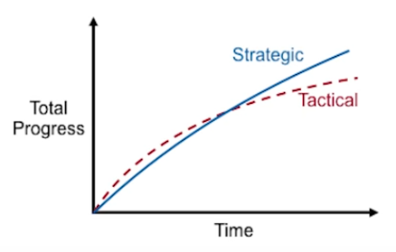

# 成为代码拯救师

Produced by 王韬 Wang, Tao

https://miffyliye.org/

---

## 长期项目需要战略编程

* 战术编程初期速度快，后期复杂度显著增加
* 战略编程长远投资控制复杂度，后期速度快

> 

> <small>Image from *[John Ousterhout: "A Philosophy of Software Design" | Talks at Google](https://www.youtube.com/watch?v=bmSAYlu0NcY)*</small>

---

## 创业初期并不是只能战术编程

* 创业初期紧张的进度压力鼓励人们进行战术编程
* Facebook初期: Move fast and break things.
* Facebook后来: Move fast with stable infrastructure.
* Google创业初期偏战略也成功了

---

## 拯救代码仅投资时间是不够的

* “以前是因为赶进度所以代码粗糙，时间充裕代码自然就能写好了”
* “以前是因为赶进度所以不写自动化测试，时间充裕自动化测试自然就能写好了”
* TA早期的环境没有优质的代码，不会强烈渴望TA没有见过的东西，不知道优质的代码是什么样子，无法写TA所不知道的另一种代码

---

## 成为代码拯救师系列课程

* 测试驱动开发
* 持续集成持续部署
* 重构遗留系统
* ......

